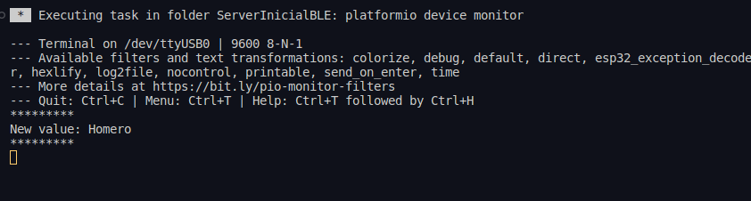

# Bluetooth LE

## Operações

## Escrita em característica

```arduino
    //@MyCharacteristicCallbacks.cpp
    class MyCharacteristicCallbacks : public BLECharacteristicCallbacks
{
    void onWrite(BLECharacteristic *pCharacteristic)
    {
        std::string value = pCharacteristic->getValue();
        if (value.length() > 0)
        {
            Serial.println("*********");
            Serial.print("New value: ");
            for (int i = 0; i < value.length(); i++)
            {
                Serial.print(value[i]);
            }
            Serial.println();
            Serial.println("*********");
        }
    }
};
```

```arduino
    //@main.cpp
    pCharacteristic->setCallbacks(new MyCharacteristicCallbacks());
```




## *Advertising*

- Após conectar uma vez com o serviço, ele não consegue ser reconectado


- É necessário iniciar um novo anúncio após desconectar

    ```arduino
    //@MyServerCallbacks.cpp
    class MyServerCallbacks: public BLEServerCallbacks {
        void onDisconnect(BLEServer* pServer) {
        Serial.println("Cliente desconectado");
        BLEDevice::startAdvertising();
        };
    };
    ```

    ```arduino
        //@main.cpp
        pCharacteristic->setCallbacks(new MyServerCallbacks());
    ```

    