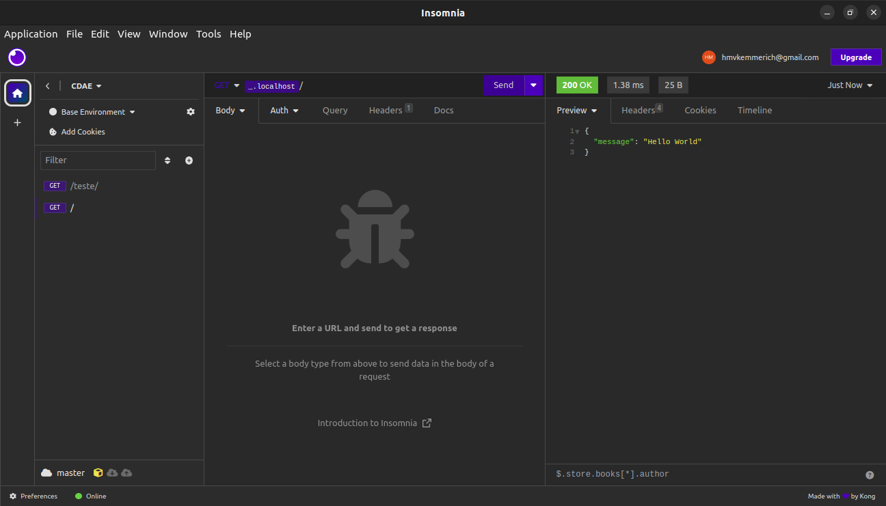

# Serviços Web 

## Python e FastAPI

## Arquivos
- [FontesPythonServiços](../../FontesPythonServiços/)
- [Especificações](./assets/openapi.json)

### Instalando o FastAPI

```bash
pip install "fastapi[all]"
```

### Rodando o código

- Arquivo [main.py](../../FontesPythonServiços/main.py)

```bash
cd FontesPythonServiços
```
```bash
uvicorn main:app
```




- Adicionar extensão "REST Client" by Huachao Mao

- Acessar o arquivo [primeiro.http](../../FontesPythonServiços/testando/primeiro.http)

## Conexão utilizando ESP-32

- Deixe o serviço python rodando em paralelo

- Abra o projeto [AulasREST](../../AulasRest/) utilizando o PlatformIO

- Rode o serviço em python novamente, dessa vez substituindo o [localhost] pelo IP da máquina
```bash
uvicorn main:app --host [ip.address] --reload
```


[localhost]: 127.0.0.1