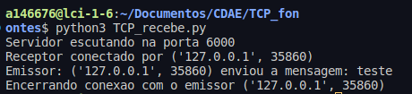

# Notas

O arquivo [TCP_recebe.py](TCP_recebe.py) deve ser executado primeiro para que a comunicação funcione sem erros.

## Por que?

Se isso não ocorrer, ao tentar conectar, o destino não estará escutando, o que irá gerar o seguinte erro.

Isso acontece pois o protocolo TCP exige um **destino**. Caso o mesmo não exista ou não seja informado, a conexão não será realizada.

## Observações

Veja que a porta escutando é a 6000, enquanto a mensagem é recebida na porta aberta especificamente para isso.

