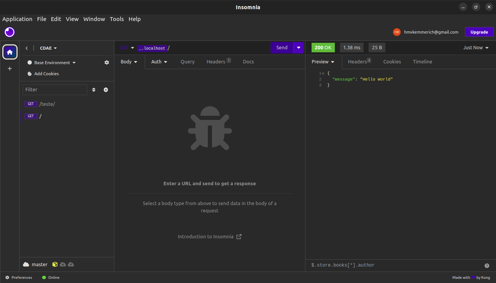
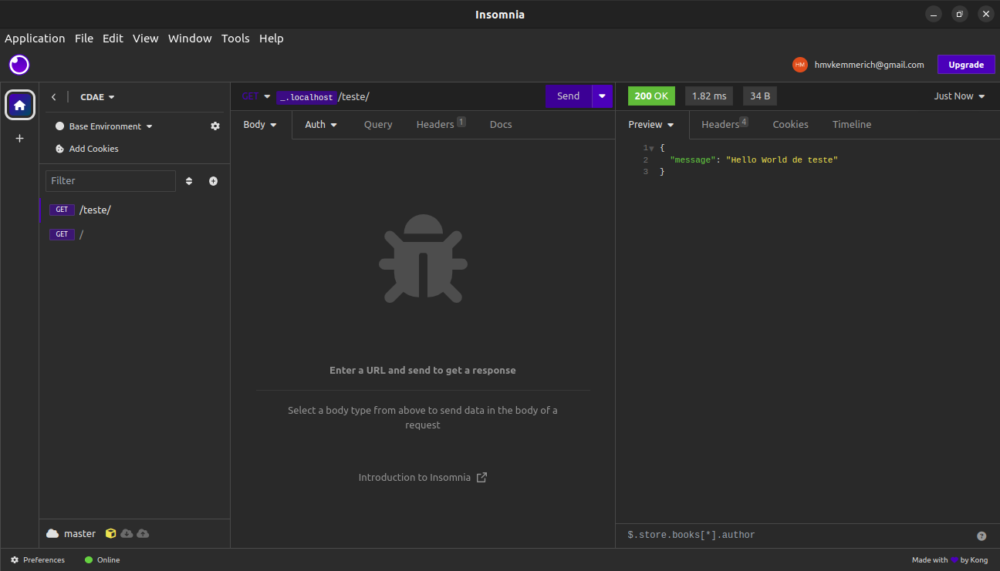
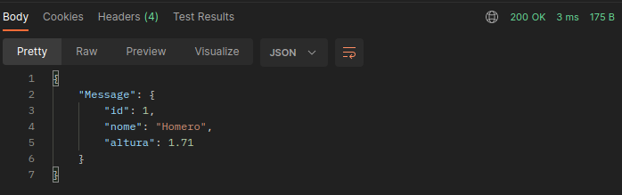

# Serviços Web

## Overview

- [Python e FastAPI](#2023-10-10)
    - [Perguntas](#perguntas)

## 2023-10-10 

Python e FastAPI

### Arquivos
- [FontesPythonServiços](../../FontesPythonServiços/)
- [Especificações](./assets/openapi.json)

### Instalando o FastAPI

```bash
pip install "fastapi[all]"
```

### Rodando o código

- Arquivo [main.py](../../FontesPythonServiços/main.py)

```bash
cd FontesPythonServiços
```
```bash
uvicorn [path/to/file]:app --reload
```





- Adicionar extensão "REST Client" by Huachao Mao

- Acessar o arquivo [primeiro.http](../../FontesPythonServiços/testando/primeiro.http)

## Conexão utilizando ESP-32

- Deixe o serviço python rodando em paralelo

- Abra o projeto [AulasREST](../../AulasRest/) utilizando o PlatformIO

- Rode o serviço em python novamente, dessa vez substituindo o [localhost] pelo IP da máquina
```bash
uvicorn main:app --host [ip.address] --reload
```

[localhost]: 127.0.0.1

## Fast API

### Rotas

- [Rotas.py](../../FontesPythonServiços/rotas.py)

- [Documentation](./assets/openapi(2).json)

### Métodos

- [Metodos.py](../../FontesPythonServiços/metodos.py)
- [Documentation](./assets/openapi%20(3).json)

### Argumentos

#### Path

- [Argumentos.py](../../FontesPythonServiços/argrotas.py)
- [Documentation](./assets/openapi%20(4).json)

#### Query

- [Query.py](../../FontesPythonServiços/queryparam.py)
- [Documentation](./assets/openapi%20(5).json)

#### Perguntas 

**Por que A biblioteca HTTPClient não possui o método `DELETE`?**

Por ser uma biblioteca voltada para IoT, não faz sentido que um dispositivo com essa finalidade apague dados.

## 2023-10-17

[pessoa.py]: ./FontesPythonServiços/pessoa.py
[servPessoa.py]: ./FontesPythonServiços/servPessoa.py

[pessoa2.py]: ./FontesPythonServiços/pessoa2.py
[servPessoa2.py]: ./FontesPythonServiços/servPessoa2.py

- TAD: Tipo abstrato de dados
- [pydantic](https://docs.pydantic.dev/latest/)

### Pessoa

#### Arquivos
- [pessoa.py]
- [servPessoa.py]

#### Notas

- Observe que o código de resposta é `200 OK`
    
    - Isso ocorre pois o objeto não está sendo armazenado em um banco de dados, apenas retornado como resposta

### Pessoa 2

#### Arquivos

- [pessoa2.py]
- [servPessoa2.py]


## Links externos

- Postman collection